<div align="center">



<a href="https://git.io/typing-svg">
  
</a>

<br/>


<br/>

[](https://linkedin.com/in/ashishnaikwade)
[](mailto:ashishnaikwade7777@gmail.com)
[](https://github.com/aashishlab)
[](tel:+919657000690)

<br/>


</div>

<br/>

---

## 🧠 About Me

```yaml
name: "Ashish Naikwade"
github: "aashishlab"
education: "B.Tech CSE, Walchand College of Engineering, Sangli"
focus:
  - Building full-stack MERN applications with real-world impact
  - Integrating AI/LLM APIs (Gemini) into practical, usable products
  - Computer vision & accessibility-focused desktop automation
  - Rapid prototyping for hackathons and academic project competitions
philosophy: "Build things that solve real problems — the rest is just syntax."
```

I'm a Computer Science undergraduate at Walchand College of Engineering with hands-on full-stack development experience across two internships, building production-style MERN applications and AI-augmented tools. I enjoy solving practical problems end-to-end — from designing AI-powered logistics platforms for agriculture supply chains to engineering multimodal accessibility assistants using computer vision and speech recognition. Alongside engineering, I've led student council initiatives and organized large-scale technical events, combining technical execution with leadership and community building.

**🎯 Open To:**


---

## 🛠️ Tech Stack

**Languages**

    

**Frontend**

    

**Backend & Databases**

      

**AI, DevOps & Tooling**

       

---

## 🤖 AI / ML Expertise

<div align="center">

| Domain | Proficiency | Details |
|---|:---:|---|
| **LLM API Integration** | ⭐⭐⭐⭐☆ | Integrating Google Gemini API for AI-powered Q&A, recommendations, and automation |
| **Computer Vision** | ⭐⭐⭐⭐☆ | OpenCV & MediaPipe-based gesture recognition, eye tracking, AI Mouse, Air Canvas, OCR, object detection |
| **Speech & NLU** | ⭐⭐⭐☆☆ | Voice-command execution using SpeechRecognition for hands-free system control |
| **AI-Powered Automation** | ⭐⭐⭐⭐☆ | Multimodal desktop assistant automating 100+ Windows apps and workflows via natural language |
| **AI-Assisted Allocation Systems** | ⭐⭐⭐☆☆ | AI-powered slot allocation and hub recommendation logic for logistics optimization |

</div>

---

## 🚀 Featured Projects

<details>
<summary><b>🔷 KisanSaarthi AI — AI-Driven Logistics Orchestration Platform</b></summary>
<br/>

A full-stack platform built to streamline vehicle slot booking and unloading operations at agro-industrial hubs (sugar mills, dairy plants, APMC mandis), eliminating multi-day vehicle congestion and reducing accident risk.

| Category | Detail |
|---|---|
| **Stack** | React.js, Node.js, Express.js, MongoDB |
| **Scale** | Multi-industry hub support with real-time queue monitoring |
| **Performance** | AI-powered slot allocation to minimize wait time and congestion |
| **Security** | Structured REST API layer with database-driven session handling |
| **Impact** | Reduced waiting time, fuel wastage, and unloading-hub congestion via a multilingual voice-enabled chatbot for farmer accessibility |
| **Repository** | [github.com/aashishlab/KisanSaarthi-AI](https://github.com/aashishlab/KisanSaarthi-AI) |

Built an AI-powered slot allocation engine combined with a nearby-hub recommendation system, alongside a multilingual, voice-enabled chatbot to make the platform accessible to farmers with varying literacy and language needs — improving queue optimization and operational safety at unloading hubs.

</details>

<details>
<summary><b>🔷 AI-Powered Virtual Assistant for Accessibility & System Automation</b></summary>
<br/>

A multimodal desktop assistant enabling hands-free computer control through voice commands, gesture recognition, and computer vision — built to improve accessibility and automate everyday system tasks.

| Category | Detail |
|---|---|
| **Stack** | Python, OpenCV, MediaPipe, SpeechRecognition, Gemini API, Eel |
| **Scale** | 10+ integrated AI-powered automation and accessibility features |
| **Performance** | Voice-based execution across 100+ Windows applications and website navigation |
| **Security** | Local system-level automation with controlled command execution |
| **Impact** | Delivered a fully hands-free experience via AI Mouse, gesture recognition, eye tracking, Air Canvas, OCR, object detection, and voice-controlled volume/system control |
| **Repository** | Available on request / GitHub |

Engineered a full computer-vision automation suite — including gesture-based mouse control, eye tracking, an Air Canvas drawing module, OCR text recognition, and object detection — layered with Gemini-powered natural language question answering and WhatsApp automation, all orchestrated through a lightweight Eel-based desktop UI.

</details>

<details>
<summary><b>🔷 Web Audit Pro — AI-Powered Chrome Extension</b></summary>
<br/>

A lightweight Chrome extension that audits any website in real time across SEO, accessibility, performance, and security, generating an AI-powered scoring dashboard entirely client-side.

| Category | Detail |
|---|---|
| **Stack** | JavaScript, HTML, CSS, Chrome Extension APIs, Gemini AI API |
| **Scale** | 30+ audit parameters across 5 categories |
| **Performance** | Weighted scoring engine (SEO 35% · Accessibility 25% · Security 25% · Performance 15%) |
| **Security** | 100% local processing — no data sent to servers, XSS-safe output |
| **Impact** | Instant 0–100 site health score with exportable JSON/CSV reports |
| **Repository** | [github.com/aashishlab/Web-audit-pro](https://github.com/aashishlab/Web-audit-pro) |

Built a fully client-side auditing engine inspecting DOM structure, meta tags, load timings, and security signals, with an optional Gemini API call to generate plain-English AI recommendations — paired with a companion demo site (`Web-audit-pro-demo`).

</details>

---

## 💼 Experience

### Operations Analyst Intern
**Pruthvi Zero Foundation** · *Dec 2025 – Jan 2026* · Sangli, Maharashtra

- Managed and analyzed CSR data for 500+ companies, ensuring accurate reporting and compliance tracking
- Designed 50+ social media creatives and campaign assets to support digital outreach initiatives
- Prepared analytical reports and dashboards to support strategic planning and operational decision-making

`Data Analysis` `Excel` `Reporting` `Dashboards` `Content Design`

<br/>

### Full Stack Developer Intern
**VikasG Web Solutions Pvt. Ltd.** · *Jun 2024 – Aug 2024* · Latur, Maharashtra

- Developed responsive web applications using React.js and contributed to 5+ client projects
- Built full-stack web applications using the MERN stack, implementing authentication and database-driven features
- Developed 10+ RESTful API endpoints for authentication, CRUD operations, and database integration using Node.js and Express.js

`React.js` `Node.js` `Express.js` `MongoDB` `REST APIs` `Authentication`

---

## 🏆 Achievements

<div align="center">

| Recognition | Details |
|---|---|
| 🥇 **First-Year Topper** | Ranked #1 among 800+ students, Puranmal Lahoti Government Polytechnic, Latur |
| 🎓 **DIPEX 2025 Finalist** | Selected among projects across 6 academic departments for the Ideas Presentation Round |
| 🏛️ **MSBTE State-Level Project Competition** | Represented the institute at the state-level round |
| 🦈 **GitHub Pull Shark** | Achievement for merged pull request contributions |
| 🗳️ **Elected General Secretary** | Student Council; led the annual gathering for 1,200+ students |
| 💻 **Chief Coordinator, DreamTech 2K24** | Organized technical events and competitions with 150+ participants |

</div>

---

## 🎓 Education

<div align="center">

| Institution | Program | Duration | Score |
|---|---|:---:|:---:|
| **Walchand College of Engineering, Sangli** | B.Tech in Computer Science & Engineering | 2025 – 2028 | 8.26 CGPA |
| **Puranmal Lahoti Government Polytechnic, Latur** | Diploma in Information Technology | 2022 – 2025 | 95.63% |

</div>

---

## 🌟 Leadership & Extracurricular Activities

- Elected **General Secretary**, Student Council — led the successful execution of the annual gathering with 1,200+ student participation
- **Chief Coordinator**, DreamTech 2K24 — organized technical events and competitions with 150+ participants
- **Chairman**, Electoral Literacy Club — promoted voter awareness and student engagement initiatives across campus
- **Designer**, WLUG & ACSES — created promotional materials and event branding assets
- Contributed to **NBA Accreditation** through documentation management, website updates, and process improvement activities

---

## 💻 Coding Profiles

<div align="center">

[](https://leetcode.com/aashishlab)
[](https://geeksforgeeks.org/user/aashishlab)
[](https://hackerrank.com/aashishlab)

*Update the links above with your actual coding profile usernames.*

</div>

---

## 📊 GitHub Analytics

<div align="center">


<br/>


</div>

---

## 🏆 GitHub Trophies

<div align="center">


</div>

---

## 📈 Contribution Activity

<div align="center">


</div>

---

## 🐍 Contribution Snake

<div align="center">


*Requires a `aashishlab/aashishlab` profile repo with the snake-generation GitHub Action set up.*

</div>

---

## 🎯 Current Focus

```yaml
learning:
  - Advanced MERN stack architecture and API design patterns
  - Deeper AI/LLM integration for production-grade applications

building:
  - KisanSaarthi AI — refining slot allocation logic and chatbot accessibility
  - AI Virtual Assistant — expanding computer-vision automation modules

exploring:
  - Computer vision applications for accessibility tooling
  - AI-assisted rapid prototyping workflows

open_to:
  - Full Stack Developer internships and full-time roles
  - Hackathons, academic project competitions, and open-source collaboration
```

---

## 📬 Connect With Me

<div align="center">

[](mailto:ashishnaikwade7777@gmail.com)
[](https://linkedin.com/in/ashishnaikwade)
[](https://github.com/aashishlab)
[](tel:+919657000690)

</div>

---

<div align="center">

*"Build things that solve real problems — the rest is just syntax."*


</div>
